# 不锈钢橱柜工厂管理系统 - 业务流程图

**版本**: V1.0
**创建日期**: 2026-04-17
**基于文档**: 11_完整数据库设计 + ER图 + 经销商管理 + 硬件适配

---

## 一、主业务流程（端到端）

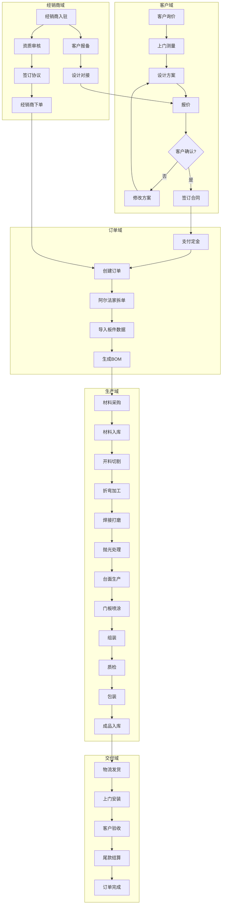

---

## 二、订单创建流程（阿尔法家对接）

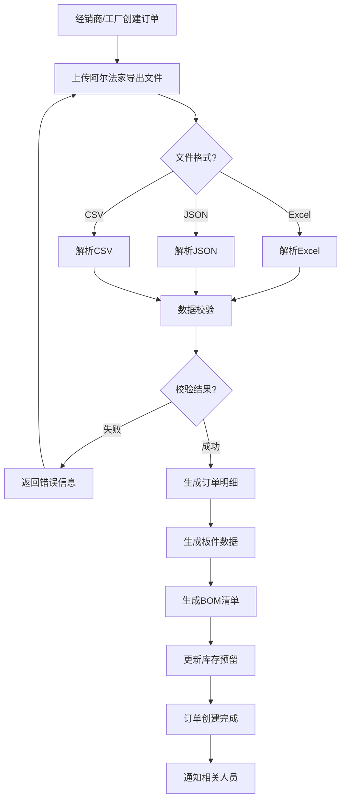

---

## 三、生产追踪流程

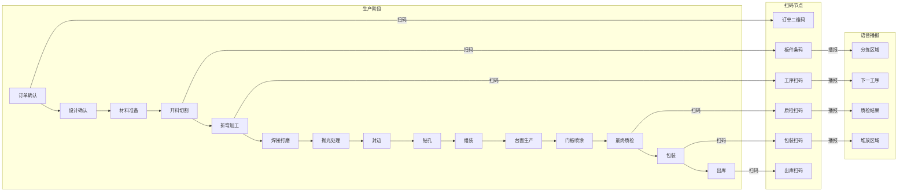

---

## 四、采购流程

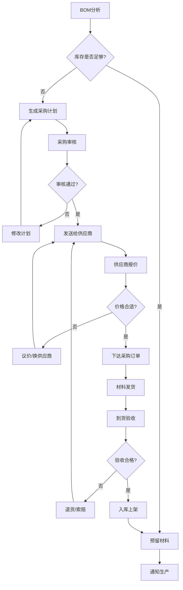

---

## 五、经销商下单流程

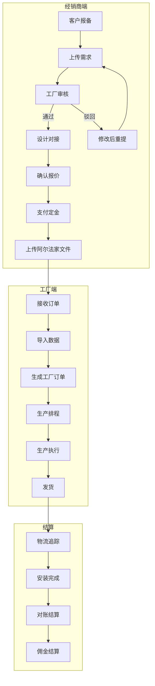

---

## 六、仓库出入库流程

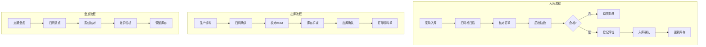

---

## 七、质量检验流程

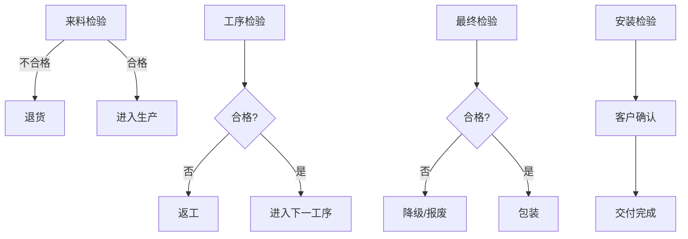

---

## 八、财务结算流程

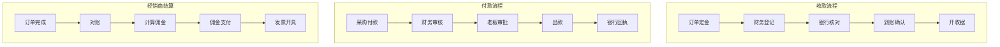

---

## 九、硬件集成流程

### 9.1 考勤打卡流程


### 9.2 扫码分拣流程

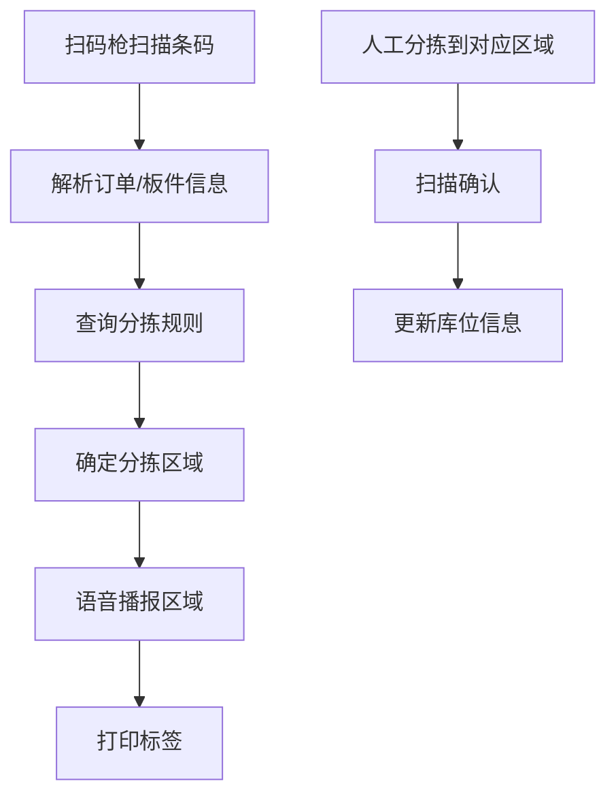

### 9.3 异常告警流程

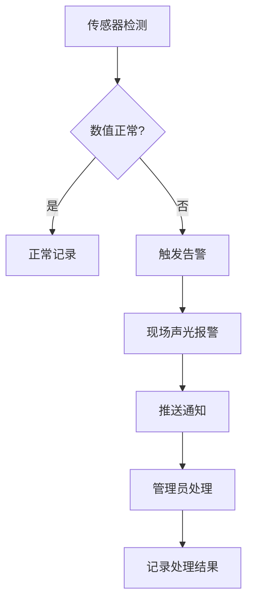

---

## 十、关键业务规则

### 10.1 订单状态流转

| 当前状态 | 可执行动作 | 目标状态 |
|---------|-----------|---------|
| draft | 提交 | pending |
| pending | 开始生产 | producing |
| producing | 发货 | shipped |
| shipped | 安装完成 | installed |
| installed | 验收完成 | completed |
| any | 取消 | cancelled |

### 10.2 生产阶段顺序

```
订单确认 → 设计确认 → 材料准备 → 开料切割 → 折弯 → 焊接打磨 → 抛光 → 封边 → 钻孔 → 组装 → 台面生产 → 门板喷涂 → 质检 → 包装 → 出库
```

### 10.3 经销商权限

| 功能 | 管理员 | 销售 | 设计 | 财务 |
|------|--------|------|------|------|
| 客户管理 | 全部 | 本门店 | 关联客户 | 无 |
| 订单管理 | 全部 | 查看 | 导入设计 | 查看金额 |
| 收款登记 | 是 | 否 | 否 | 是 |
| 采购管理 | 是 | 否 | 否 | 查看 |

---

## 十一、流程图图例

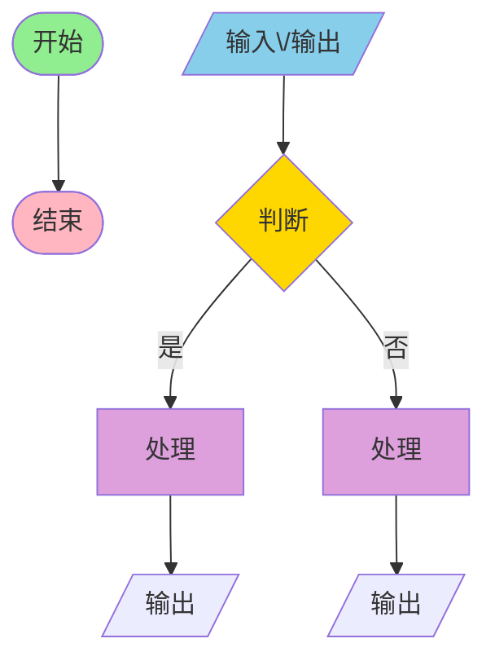

---

*文档版本: V1.0*
*更新日期: 2026-04-17*
