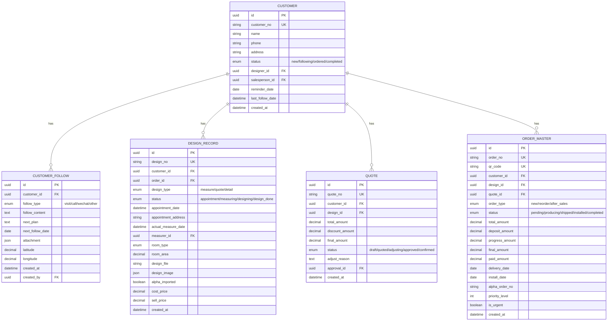
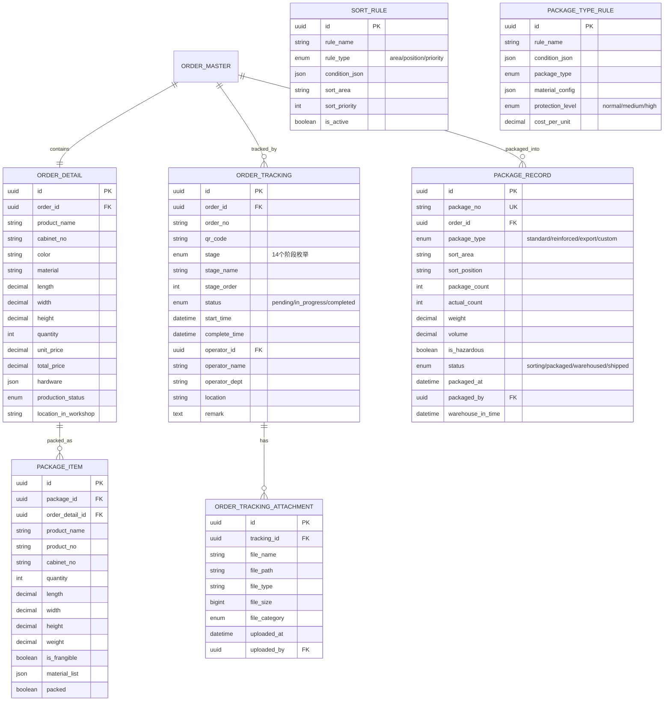
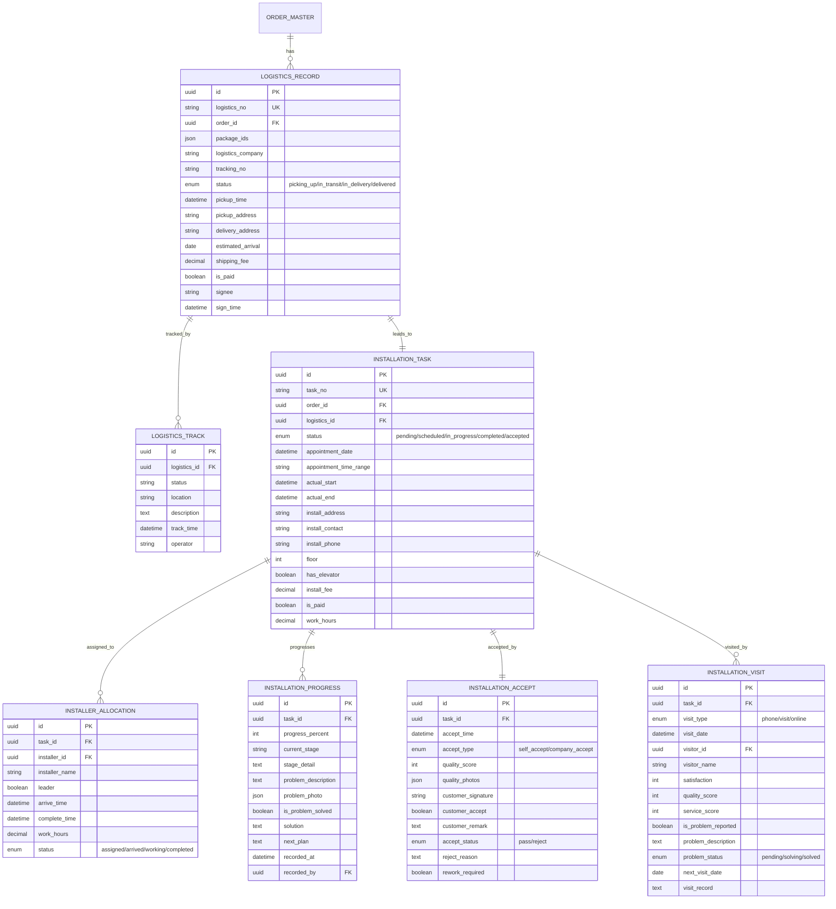
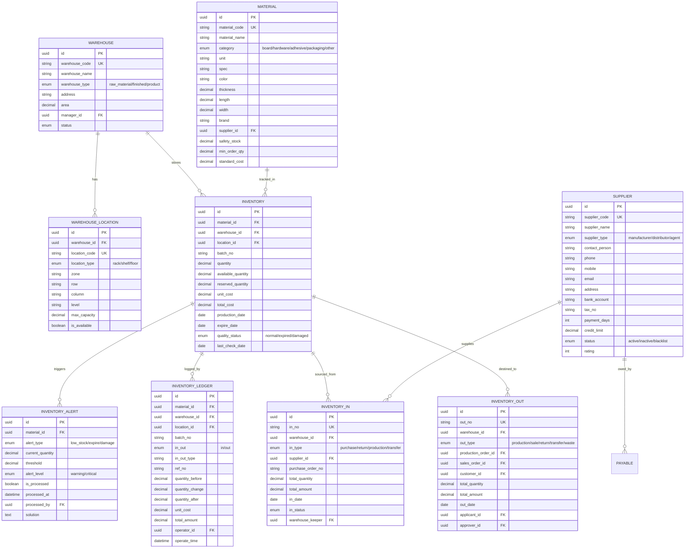
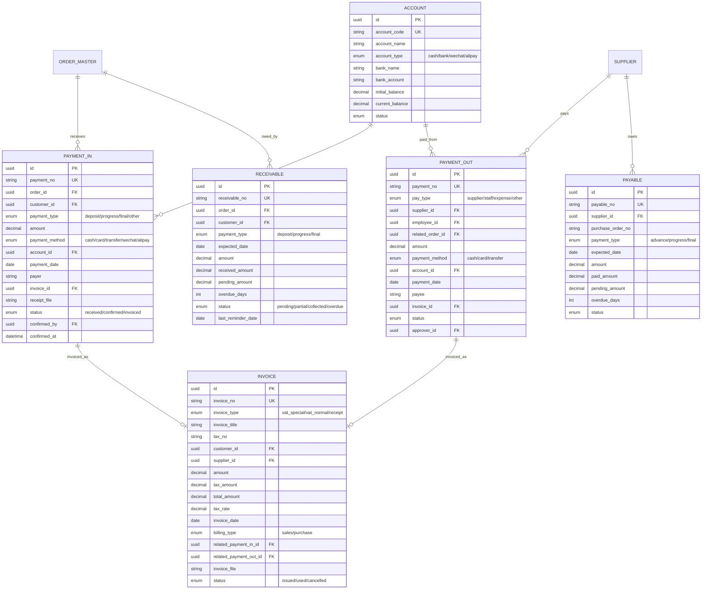
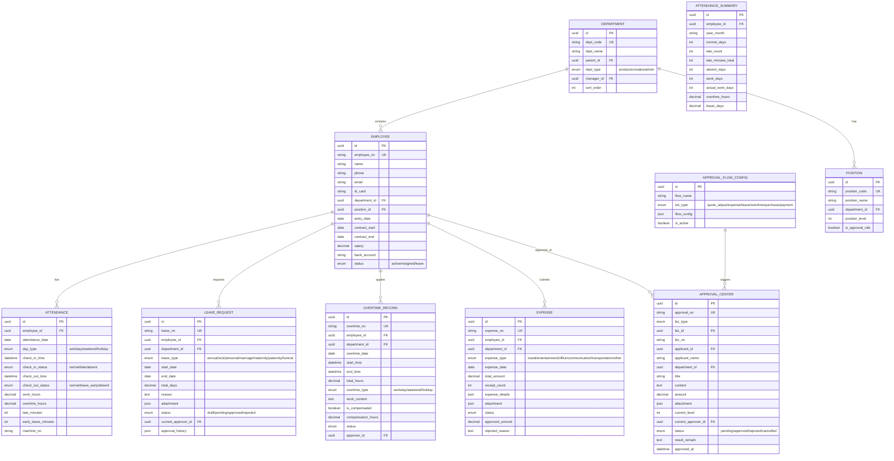
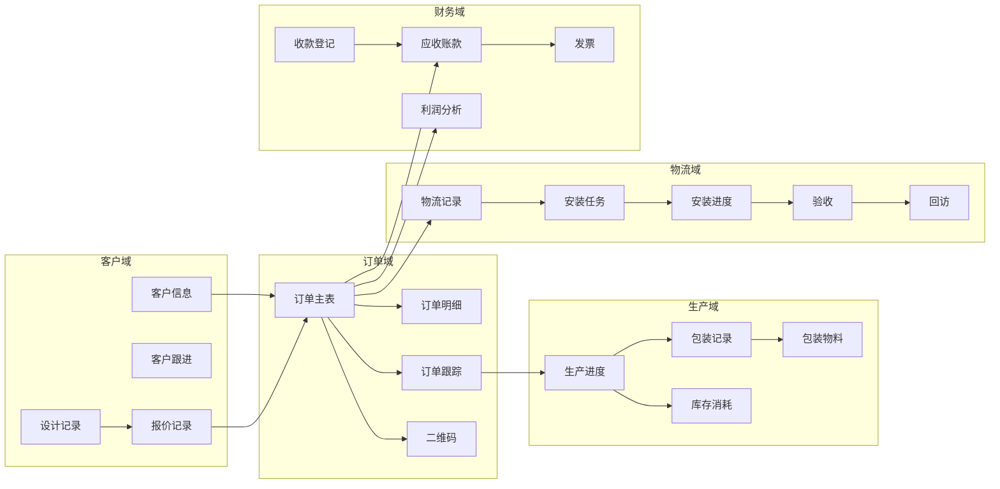
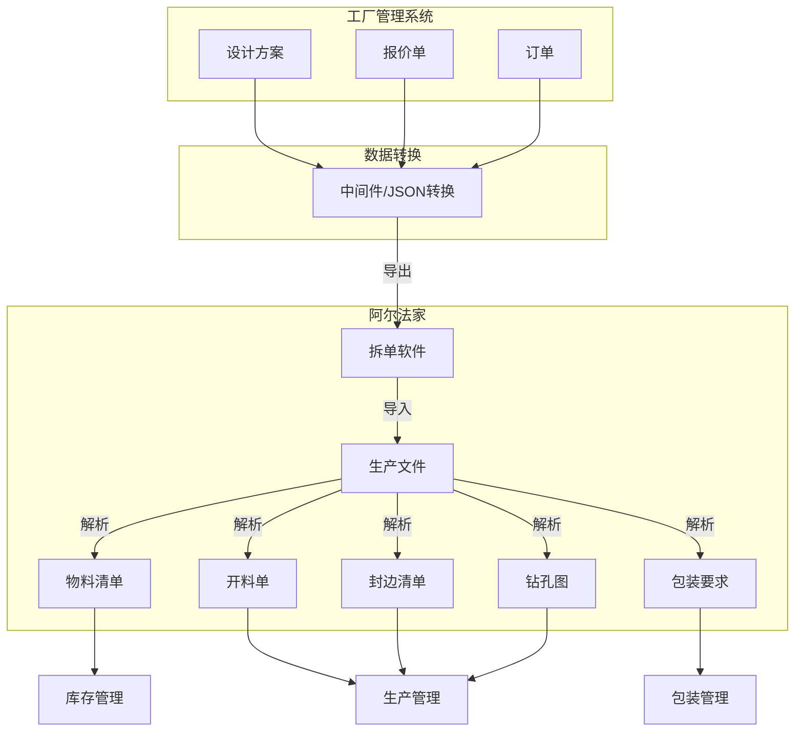

# 不锈钢橱柜工厂管理系统 - ER图与流程图

## 一、核心模块ER关系图

### 1.1 客户域 (Customer Domain)



### 1.2 生产域 (Production Domain)



### 1.3 物流安装域 (Logistics & Installation Domain)



### 1.4 仓库域 (Warehouse Domain)



### 1.5 财务域 (Finance Domain)



### 1.6 OA域 (OA Domain)



---

## 二、业务流程图

### 2.1 客户生命周期流程

```mermaid
stateDiagram-v2
    [*] --> 新建客户: 录入信息
    新建客户 --> 跟进中: 首次跟进
    跟进中 --> 跟进中: 持续跟进
    跟进中 --> 已下单: 确认订单
    已下单 --> 跟进中: 订单取消/变更
    已下单 --> 生产中: 开始生产
    生产中 --> 已发货: 包装发货
    已发货 --> 安装中: 物流到达
    安装中 --> 安装完成: 安装确认
    安装完成 --> 客户验收: 客户确认
    客户验收 --> 已完成: 验收通过
    客户验收 --> 安装中: 验收不通过
    已完成 --> [*]
    
    note right of 新建客户: 状态: new
    note right of 跟进中: 状态: following
    note right of 已下单: 状态: ordered
    note right of 已完成: 状态: completed
```

### 2.2 订单生产追踪流程

```mermaid
flowchart TD
    subgraph 订单确认
        A[客户下单] --> B[订单审核]
        B --> C[生成订单编号]
        C --> D[生成订单二维码]
    end
    
    subgraph 设计阶段
        D --> E[设计确认]
        E --> F[导入阿尔法家]
    end
    
    subgraph 生产阶段
        F --> G[材料准备]
        G --> H[开料切割]
        H --> I[封边]
        I --> J[钻孔]
        J --> K[组装]
        K --> L[质检]
    end
    
    subgraph 包装发货
        L --> M[分拣]
        M --> N[包装]
        N --> O[生成物料清单]
        O --> P[仓库出库]
    end
    
    subgraph 物流安装
        P --> Q[物流发货]
        Q --> R[物流跟踪]
        R --> S[到达安装]
        S --> T[安装预约]
        T --> U[安装人员分配]
        U --> V[安装施工]
        V --> W[安装进度记录]
        W --> X[安装完成]
    end
    
    subgraph 验收回访
        X --> Y[客户验收]
        Y --> Z{验收通过?}
        Z -->|是| AA[安装回访]
        Z -->|否| V[返工]
        AA --> AB[订单完成]
        AB --> AC[二维码归档]
    end
    
    AC --> [*]
```

### 2.3 报价审批流程

```mermaid
flowchart TD
    A[新建报价] --> B[编辑报价明细]
    B --> C[计算总价]
    C --> D[提交报价]
    D --> E[已报客户]
    E --> F{客户反馈}
    F -->|价格合适| G[价格成交]
    F -->|需要调价| H[申请调价]
    
    H --> I{调价幅度}
    I -->|≤5%| J[1级审批]
    I -->|5%~10%| K[2级审批]
    I -->|>10%| L[3级审批]
    
    J --> M{审批结果}
    K --> M
    L --> M
    
    M -->|通过| G
    M -->|驳回| N[修改重新申请]
    N --> B
    
    G --> O[生成订单]
    O --> P[订单确认]
    P --> [*]
```

### 2.4 包装分拣流程

```mermaid
flowchart TD
    A[订单完成生产] --> B[生成包装任务]
    B --> C[获取订单信息]
    C --> D[匹配分拣规则]
    
    D --> E{匹配结果}
    E -->|区域规则| F[分配堆放区域]
    E -->|优先级规则| G[调整堆放优先级]
    E -->|位置规则| H[分配具体库位]
    
    F --> I[分拣确认]
    G --> I
    H --> I
    
    I --> J[选择包装方式]
    
    J --> K{匹配规则}
    K -->|标准包装| L[标准材料配置]
    K -->|加强包装| M[加强材料配置]
    K -->|出口包装| N[出口材料配置]
    K -->|定制包装| O[自定义配置]
    
    L --> P[执行包装]
    M --> P
    N --> P
    O --> P
    
    P --> Q[生成物料清单]
    Q --> R[打印标签]
    R --> S[入库确认]
    S --> T[关联物流]
    T --> [*]
```

### 2.5 财务收款流程

```mermaid
flowchart TD
    A[订单创建] --> B[应收账款生成]
    B --> C{款项类型}
    
    C -->|订金 30%| D[应收订金]
    C -->|进度款 50%| E[应收进度款]
    C -->|尾款 20%| F[应收尾款]
    
    D --> G[收款登记]
    E --> G
    F --> G
    
    G --> H{付款方式}
    H -->|现金| I[登记现金收款]
    H -->|转账| J[登记银行转账]
    H -->|微信| K[登记微信收款]
    H -->|支付宝| L[登记支付宝收款]
    
    I --> M[更新账户余额]
    J --> M
    K --> M
    L --> M
    
    M --> N[更新应收账款]
    N --> O[开具发票]
    O --> P[关联发票记录]
    P --> Q[应收账款完成]
    Q --> [*]
```

### 2.6 OA审批流程

```mermaid
flowchart TD
    A[员工提交申请] --> B[审批中心记录]
    B --> C[获取审批流程配置]
    C --> D[确定审批级别]
    
    D --> E{审批级别}
    E -->|1级| F[1级审批人审批]
    E -->|2级| G[1级通过]
    G --> H[2级审批人审批]
    E -->|3级| I[1级通过]
    I --> J[2级通过]
    J --> K[3级审批人审批]
    
    F --> L{审批结果}
    H --> L
    K --> L
    
    L -->|通过| M[更新申请状态]
    L -->|驳回| N[返回申请人]
    N --> O[修改重新提交]
    O --> A
    
    M --> P[执行后续业务]
    P --> [*]
```

---

## 三、数据流向图

### 3.1 订单全生命周期数据流



### 3.2 阿尔法家数据对接流



---

## 四、ER图例说明

### 符号说明

| 符号 | 含义 |
|------|------|
| `||--||` | 一对一关系 |
| `||--o{` | 一对多关系 |
| `}o--o{` | 多对多关系 |
| `PK` | 主键 (Primary Key) |
| `FK` | 外键 (Foreign Key) |
| `UK` | 唯一键 (Unique Key) |
| `enum` | 枚举类型 |

### 颜色标识

| 模块 | 颜色 |
|------|------|
| 客户域 | 蓝色 |
| 生产域 | 绿色 |
| 物流域 | 橙色 |
| 仓库域 | 紫色 |
| 财务域 | 红色 |
| OA域 | 灰色 |

---

*文档版本: V1.0*
*生成日期: 2026-04-17*
*预览工具: VS Code (Mermaid插件) / GitHub / draw.io*
